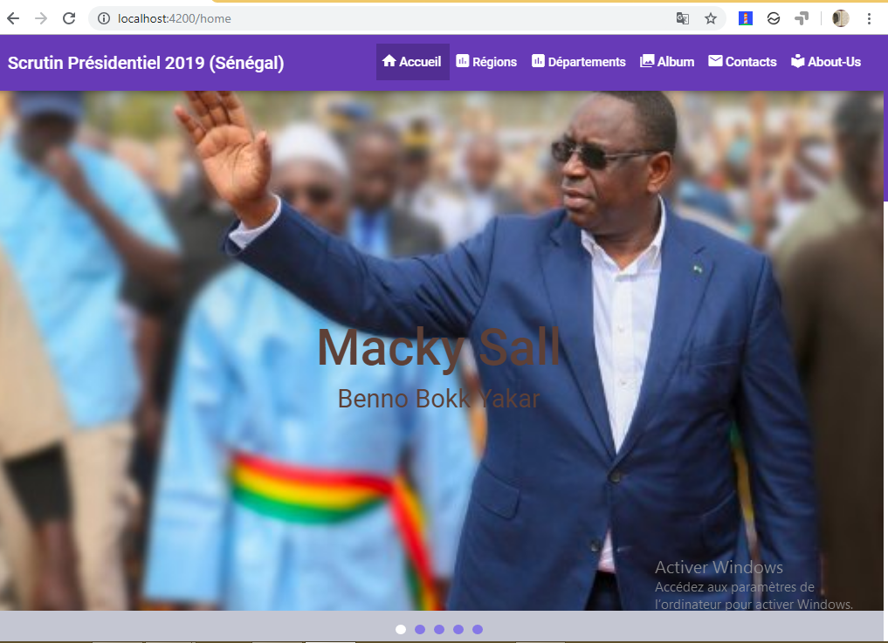
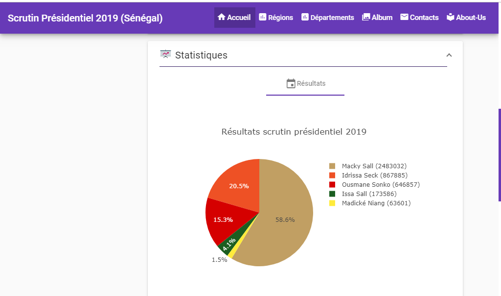
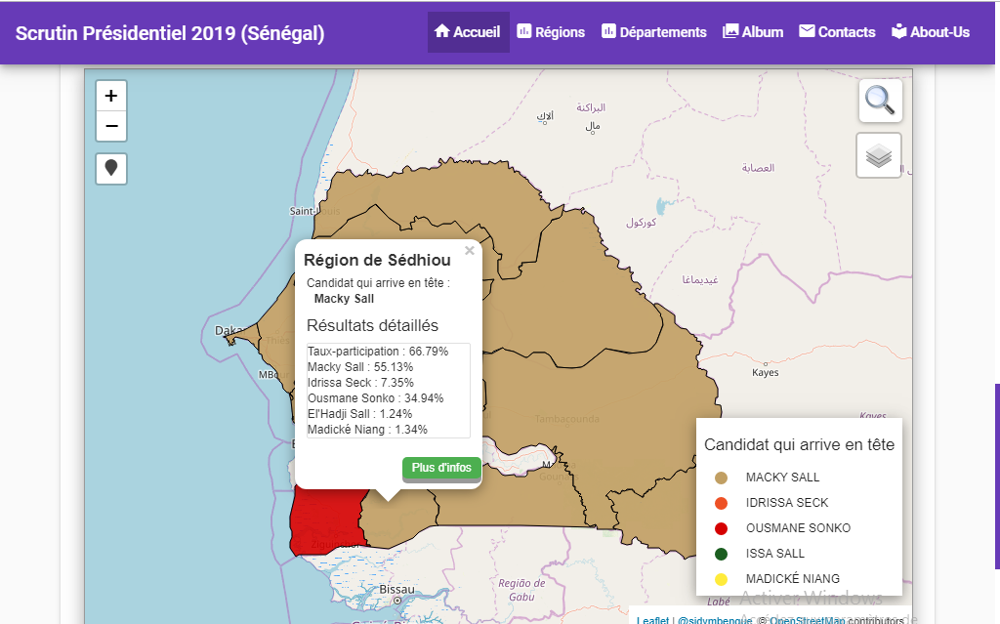
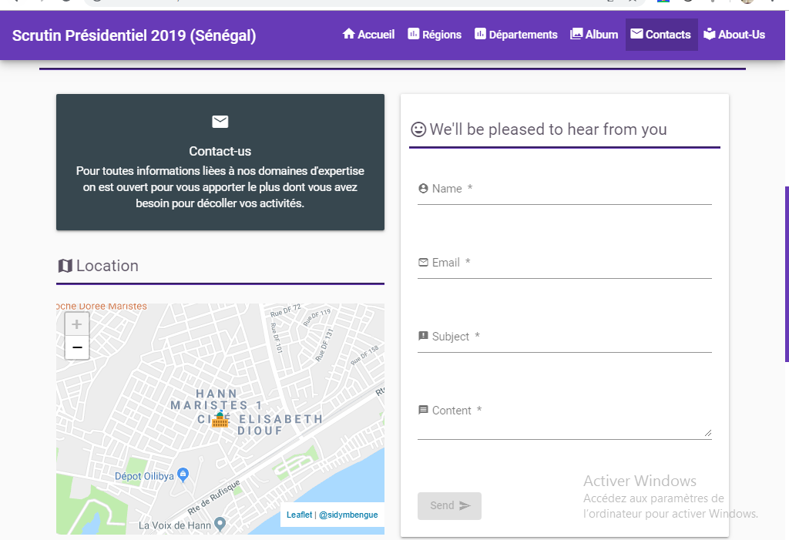
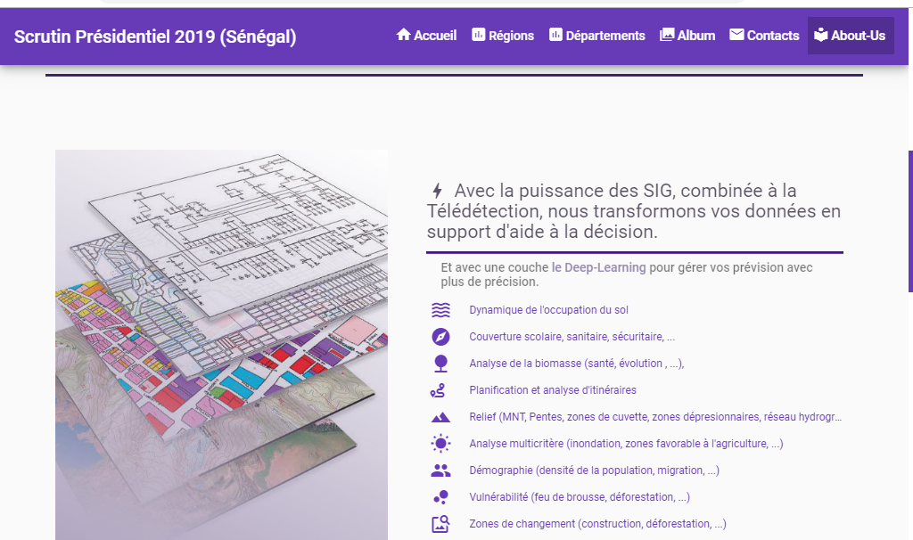
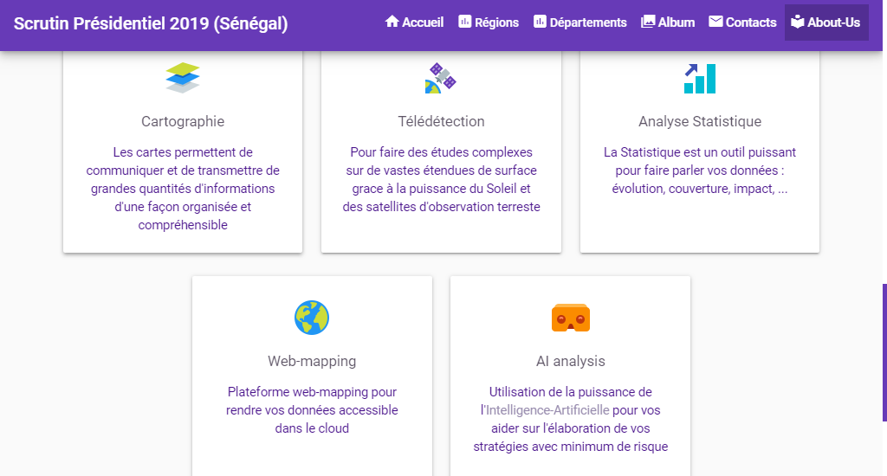

# Election Based Application

# Overview

This project is about an **geomarketing Application, market shared, geolocation, ...**.

- [x] Number of votes,
- [x] Votes for each candidates,
- [x] Mapping,
- [x] Space winner by parti color,
- [x] Statistical analysis,
- [x] Contact Page,
- [x] About-Us Page,
- [x] and more ...)

It includes most of angular concepts

- Routing and lazy-loading
- Services,
- Forms,
- Depandency Injection
- Shared components enter modules
- Service Worker (PWA)
- And more ...

## Getting started

1. Fork the project,
2. Run `npm install` and after all dependencies all installed
3. Run `ng serve`
4. With your navigator go to [localhost:4200](http://localhost:4200).

## App screenshots

---

## Usefull links

- [Angular Docs](https://angular.io/docs)
- [Angular Material](https://material.angular.io/)
- [Materialize Css](https://materializecss.com/)
- [Plotly.JS](https://plot.ly/javascript/)
- [LeafletJS](https://leafletjs.com/)

---

## Community

- Issues
  Use the GitHub issue function if you have any requests, questions, or bug reports.
- PullRequest
  Use the GitHub pull request function if you want to contribute code

---

## Author infos

Follow me on :

- [GitHub](https://github.com/sidymbengue25)
- [Twitter](https://twitter.com/mbengue_sidy)
- [Instagram](https://www.instagram.com/mbenguesidy/)
- [LinkedIn](https://www.linkedin.com/in/sidy-mbengue-a17000143/)

---

## Further help

For further informations you can ask me on sidymbengue25@gmail.com
